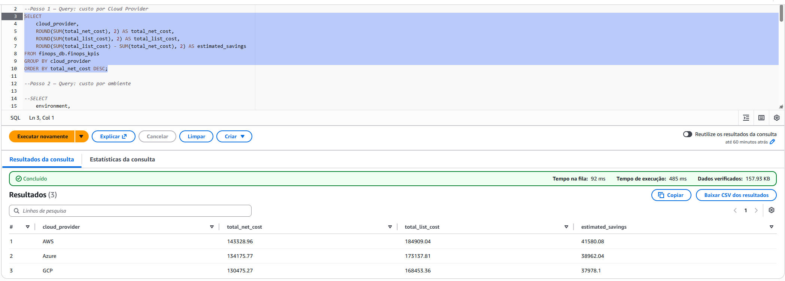
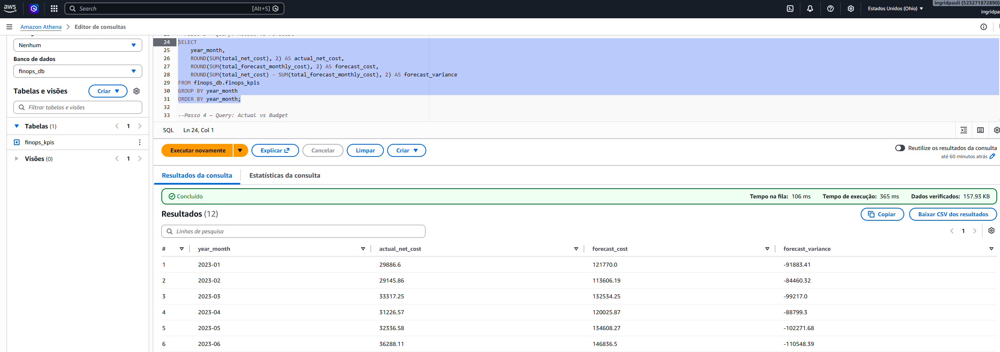
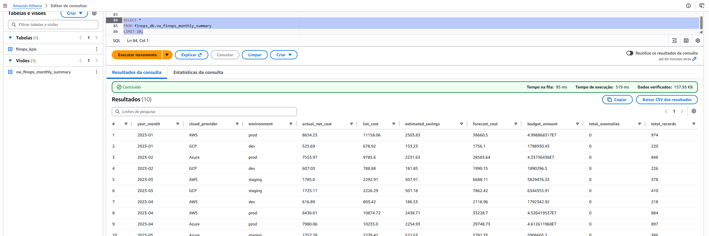
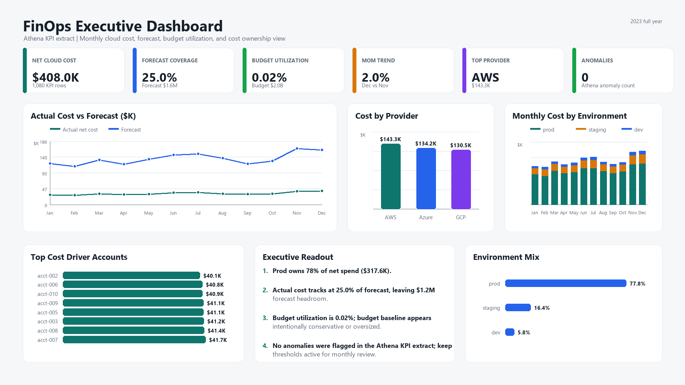
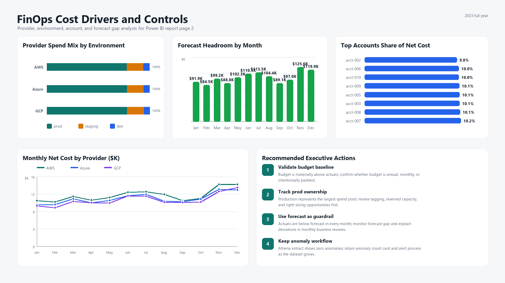

# Cloud FinOps Cost Analytics Case Study

A practical case study designed to demonstrate skills in **FinOps, AWS, cloud cost analysis, budgeting, forecasting, anomaly detection, KPI tracking, and cost optimization recommendations**.

This project simulates the work of a **Junior Cloud FinOps Analyst**, focusing on how to analyze cloud spending, compare actual costs against budget, detect unusual cost behavior, identify cost drivers, and communicate actionable recommendations to technical and business stakeholders.

---

## 1. Business Context

Cloud teams often need to understand how their infrastructure costs are behaving over time. A FinOps analyst helps engineering, product, finance, and leadership teams make better decisions by connecting cloud usage, cost, budget, and business value.

This case study uses a public Kaggle dataset:

- **Dataset:** Cloud Budget Dataset
- **Source:** https://www.kaggle.com/datasets/rasikaekanayakadevlk/cloud-budget-dataset
- **Description:** A synthetic cloud budget dataset for 2023, suitable for cost analytics, anomaly detection, budget tracking, and cloud cost optimization exercises.

---

## 2. FinOps Objectives

This project answers questions such as:

1. Which cloud services or teams are above budget?
2. What is the variance between actual cost and budget?
3. Are cloud costs increasing over time?
4. Are there any cost anomalies that should be investigated?
5. Which services are the main cost drivers?
6. What optimization actions could reduce cost without impacting operations?
7. How can cloud efficiency be monitored through KPIs?

---

## 3. Technology Stack

### Local Development

- Python
- Pandas
- NumPy
- Matplotlib
- scikit-learn
- Jupyter Notebook

### AWS Free Tier / Low-Cost Architecture

- **Amazon S3**: stores raw and processed CSV files
- **AWS Lambda**: processes a small CSV file using a serverless approach
- **Amazon Athena**: optional SQL queries over files stored in S3
- **AWS Cost Explorer**: used conceptually as the native AWS tool for cost visibility
- **AWS Budgets**: recommended to prevent unexpected charges

> Note: Athena is not fully free. It charges based on the amount of data scanned. For this case study, use small CSV files or run the analysis locally to avoid unnecessary costs.

---

## 4. Proposed Architecture

```text
Kaggle Dataset
      |
      v
Local Python / Pandas
      |
      v
data/raw/cloud_budget_2023_dataset.csv
data/raw/cloud_budget_2023_dataset_daily_account_summary.csv
data/raw/cloud_budget_2023_dataset_monthly_account_summary.csv
      |
      v
Amazon S3 - raw zone
      |
      v
AWS Lambda processing
      |
      v
Amazon S3 - processed zone
      |
      v
Power BI / Tableau / Athena / Local Dashboard
```

---

## 5. Repository Structure

```text
finops-cloud-budget-case-study/
|-- README.md
|-- requirements.txt
|-- .gitignore
|-- data/
|   |-- raw/
|   |   |-- .gitkeep
|   |   |-- cloud_budget_2023_dataset.csv
|   |   |-- cloud_budget_2023_dataset_daily_account_summary.csv
|   |   `-- cloud_budget_2023_dataset_monthly_account_summary.csv
|   `-- processed/
|       |-- .gitkeep
|       `-- finops_kpis_athena.csv
|-- src/
|   `-- finops_analysis.py
|-- aws/
|   |-- lambda/
|   |   `-- lambda_function.py
|   `-- athena/
|       |-- create_table.sql
|       `-- finops_queries.sql
|-- powerbi/
|   |-- finops_dashboard_measures.dax
|   |-- finops_dashboard_spec.md
|   `-- finops_exec_theme.json
`-- docs/
    |-- interview_talking_points.md
    |-- 05_athena_cost_by_provider.png
    |-- 06_athena_actual_vs_forecast.png
    |-- 07_athena_view_monthly_summary.png
    |-- powerbi_dashboard_executive.png
    `-- powerbi_dashboard_cost_drivers.png
```

---

## 6. Key FinOps KPIs

The analysis focuses on the following KPIs:

- Total Cloud Cost
- Total Budget
- Budget Variance
- Budget Variance %
- Cost by Service
- Cost by Team or Department
- Cost by Environment
- Top 5 Cost Drivers
- Daily or Monthly Cost Trend
- Anomaly Flag
- Forecast for the Next Period
- Potential Savings Opportunity

---

## 7. How to Run Locally

### 7.1 Download the Dataset

Option 1: Download the dataset manually from Kaggle and save it as:

```text
data/raw/cloud_budget_2023_dataset.csv
data/raw/cloud_budget_2023_dataset_daily_account_summary.csv
data/raw/cloud_budget_2023_dataset_monthly_account_summary.csv
```

Option 2: Use the Kaggle API:

```bash
pip install kaggle
kaggle datasets download -d rasikaekanayakadevlk/cloud-budget-dataset -p data/raw --unzip
```


### 7.2 Create a Python Virtual Environment

```bash
python -m venv .venv
```

Windows:

```bash
.venv\Scripts\activate
```

Linux or macOS:

```bash
source .venv/bin/activate
```

Install dependencies:

```bash
pip install -r requirements.txt
```

### 7.3 Run the Analysis

```bash
python src/finops_analysis.py --input data/raw/cloud_budget.csv --output data/processed/finops_kpis.csv
```

The output file will be created at:

```text
data/processed/finops_kpis.csv
```

---

## 8. AWS Free Tier / Low-Cost Implementation

### 8.1 Safety Steps Before Using AWS

Before creating AWS resources:

1. Enable MFA on the AWS account.
2. Create a dedicated IAM user or role for this project.
3. Create an AWS Budget alert, for example USD 1 or USD 5.
4. Use only one AWS Region, such as `us-east-1`.
5. Delete all resources after finishing the case study.

### 8.2 Create an S3 Bucket

Example:

```bash
aws s3 mb s3://finops-cloud-budget-sergio-2026 --region us-east-1
```

Upload the raw dataset:

```bash
aws s3 cp data/raw/cloud_budget.csv s3://finops-cloud-budget-sergio-2026/raw/cloud_budget.csv
```

Upload the processed output:

```bash
aws s3 cp data/processed/finops_kpis.csv s3://finops-cloud-budget-sergio-2026/processed/finops_kpis.csv
```

### 8.3 Create an AWS Lambda Function

The Lambda function located at:

```text
aws/lambda/lambda_function.py
```

reads the raw CSV file from S3, calculates FinOps KPIs, and writes the processed CSV file back to S3.

Suggested configuration:

- Runtime: Python 3.12
- Memory: 128 MB
- Timeout: 30 seconds
- Trigger: Manual test or S3 Object Created event
- IAM Role: minimum permission to read from `raw/` and write to `processed/`

Environment variables:

```text
BUCKET_NAME=finops-cloud-budget-sergio-2026
INPUT_KEY=raw/cloud_budget.csv
OUTPUT_KEY=processed/finops_kpis.csv
```

### 8.4 Optional Athena Query Layer

The file below contains a sample external table definition:

```text
aws/athena/create_table.sql
```

Additional Athena analysis queries are available at:

```text
aws/athena/finops_queries.sql
```

Cost control recommendations for Athena:

- Use small files for the case study.
- Avoid `SELECT *` on large datasets.
- Use `WHERE` filters.
- Convert CSV to Parquet in future versions to reduce scanned data.
- Delete test tables and S3 files after the project.

Athena query result screenshots:







---

## 9. Suggested Analysis Sections

### 9.1 Cost vs Budget

Compare actual cloud cost against the planned budget and highlight services or months where the actual cost exceeded the budget.

### 9.2 Top Cost Drivers

Rank the services, teams, or environments responsible for the highest spend.

### 9.3 Anomaly Detection

Use a simple z-score method to flag unusual cost behavior. A cost record with a z-score greater than 2 can be reviewed as a potential anomaly.

### 9.4 Forecasting

Use a simple moving average or linear regression to estimate the next period of cloud spend.

### 9.5 Optimization Recommendations

Examples:

- **EC2:** review instance utilization, right-size underused instances, and evaluate Savings Plans or Reserved Instances for stable workloads.
- **S3:** apply lifecycle policies for old data and review storage classes.
- **Lambda:** review memory allocation, execution time, and invocation volume.
- **DEV/QA environments:** stop non-production workloads outside business hours.
- **High-growth services:** create specific budgets and investigate the main usage drivers.

---

## 10. Example Executive Summary

This case study analyzes cloud cost and budget data to identify cost drivers, budget deviations, anomalies, and optimization opportunities. The analysis provides a structured FinOps view of cloud spending, helping teams understand where costs are increasing and which actions can improve financial efficiency.

Main findings should include:

- Services or teams above budget
- Highest cost drivers
- Anomalous cost behavior
- Forecasted cost trend
- Practical recommendations for optimization

---

## 10.1 Power BI Executive Dashboard

The Athena KPI extract is available for Power BI Desktop import at:

```text
data/processed/finops_kpis_athena.csv
```

Supporting dashboard assets:

- `powerbi/finops_dashboard_spec.md`: recommended page layout and import steps
- `powerbi/finops_dashboard_measures.dax`: calculated column and DAX measures for KPI cards and charts
- `powerbi/finops_exec_theme.json`: executive dashboard theme

Recommended Power BI Desktop flow:

1. Open Power BI Desktop.
2. Select **Get data > Text/CSV**.
3. Import `data/processed/finops_kpis_athena.csv`.
4. Name the table `finops_kpis_athena`.
5. Add the calculated column and measures from `powerbi/finops_dashboard_measures.dax`.
6. Apply `powerbi/finops_exec_theme.json` from **View > Themes > Browse for themes**.

Executive dashboard screenshots:





Key dashboard readout:

- Total net cloud cost: **$408.0K**
- Forecast utilization: **25.0%**
- Budget utilization: **0.02%**
- Top provider: **AWS**
- Top environment: **prod**
- Athena anomaly count: **0**

---


## 12. Future Improvements

Possible improvements for future versions:

- Build a Power BI or Tableau dashboard.
- Convert CSV files to Parquet.
- Add a more advanced forecast model using ARIMA or Prophet.
- Create automatic alerts using SNS.
- Add simulated tags such as `CostCenter`, `Owner`, and `Environment`.
- Calculate unit economics, such as cost per customer, cost per transaction, or cost per workload.
- Add CI/CD using GitHub Actions.

---

## 13. Cleaning Up AWS Resources

Delete the S3 files:

```bash
aws s3 rm s3://finops-cloud-budget-sergio-2026 --recursive
```

Delete the S3 bucket:

```bash
aws s3 rb s3://finops-cloud-budget-sergio-2026
```

Also remove the Lambda function, IAM permissions, Athena tables, and any test resources created during the project.

---

## 14. Skills Demonstrated

This project demonstrates:

- Cloud cost analysis
- Budget tracking
- Forecasting
- Anomaly detection
- KPI creation
- AWS S3 and Lambda basics
- Python data analysis
- FinOps mindset
- Communication of technical findings to business stakeholders
